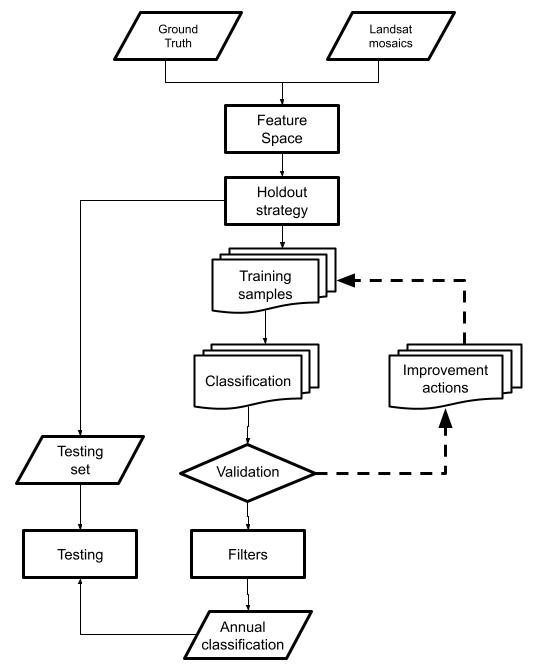
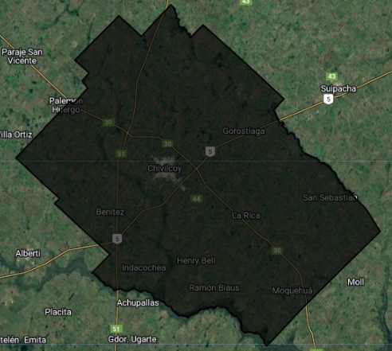
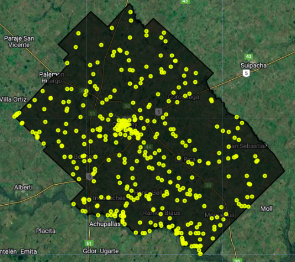

# Clasificación de uso y cobertura del suelo

## Flujo de trabajo

**Figura 1**: Flujo de clasificación supervisada

## Área de estudio

**Figura 2**: Área de estudio definida por el partido de Chivilcoy.

## Muestras de VT

**Figura 3**: Distribución del conjunto de datos de verdad terrestre.

La distribución de frecuencias de las muestras es:

| Código | Clase | Cantidad |
| --- | --- | --- |
| 3 | Leñosa Cerrada | 83 |
| 4 | Leñosa Abierta | 23 |
| 9 | Plantaciones Forestales | 25 |
| 11 | Humedal | 71 |
| 12 | Pastizal | 39 |
| 15 | Pastura |50 |
| 18 | Agricultura | 59 |
| 22 | Agua | 33 |

## Código base

Producto complet

### Leer el vector del área de estudio

### Leer el vector de verdad terrestre

### Esquema de holdout (training/testing)

### Mosaicos y feature space

### Tips de optimización: Guardados parciales

### Clasificación

### Mejoras

#### Balanceo de muestras
#### Ruido en las clases
#### Selección de modelos
