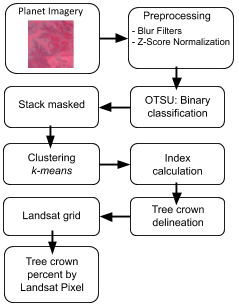

# Detección de copas a través de técnicas no supervisadas y procesamiento digital de imágenes.

Flujo de procesamiento digital de imágenes y clasificación no supervisada para detectar cobertura de copas.

 

## Preprocesamiento

 - Filtro de blur gaussiano. https://en.wikipedia.org/wiki/Gaussian_blur
 - Escatado con Z-score
 
## OTSU
 - Segmentación basada en umbrales de saturación.
 - Trabaja en escala de grises (1 sola banda)
 
## Clustering k-Means

 - Dentro de la máscara de OTSU aplicamos el agrupamiento

## Delineado de copas paso a paso

  
 